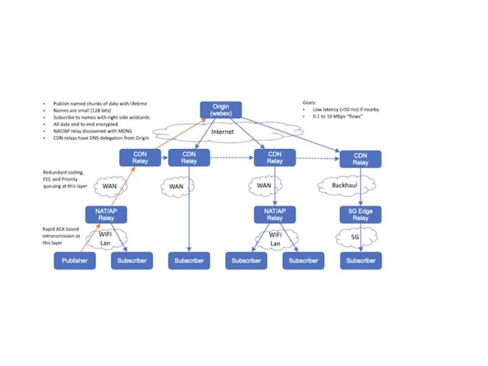

# Introduction

This outlines the design for QuicR, a media delivery protocol for applications that  needs  real time and/or streaming media experiences. It is based on a
publish/subscribe metaphor where client endpoints publish and subscribe to data that is sent to, and received from, relays in the cloud. The information subscribed to is named such that this forms an overlay information centric network.
[[todo talk about streaming and realtime usecases combined]

Typical usecases would be audio conferencing application would be for each endpoint to subscribe
to the audio from each of the other participants in the conference and as the same time publish
their audio. The cloud device that receives the subscribes and distributes data is call a Relay
and is similar to an SFU in the audio/video uses cases. QuicR is pronounced something close to
“quicker” but with more of a pirate "arrrr" at the end.

The QuicR protocol takes care of transmitting real-time data from the Publisher to the Relay. It provides a datagram like service and deals with detecting and limiting the bandwidth available and used, congestion control, end to end encryption, and prioritization of data. The maximum lifetime of data can be controlled and important data can be marked for retransmission but all data can
be lost it fails the real-time constraint. It is designed for NAT and firewall traversal as well as
high speed implementations in relays and use with load balancers. QuicR relay forwards data that was
sent to it to all the subscribers for that data. Data is named such that it is unique for the relay and scoped to a origin. Subscriptions can include a form of wild carding to the named data.

The design is usable for sending media between a set of participants in a game or video call with under a hundred milliseconds of latency and meets needs of web conferring systems. The design can also be used for large scale low latency streaming to millions of participants with latency under a few hundred milliseconds. It can also be used as low latency pub/sub system for real time in systems
such as messaging and IoT.

In the simple case, an web application could have a single relay in the cloud that forwarded packets between users in a video conference. The cloud could also have multiple relays. QuicR is designed to make it easy to implement stateless relays so that fail over could happen between relays with
minimal impact to the clients and relays can redirect a client to a different relay. It is also designed to allow high speed forwarding with ASICs, or NIC cards with on card processing, or use intel DPDK. Relay can also be chained so that a relay in a CDN network gets one copy of data from the central cloud data center and can then forward it to many clients that use that CDN. This approach can be extended to put relays very close to clients in 5G networks and put relays in home
routers or enterprise branch office that can be automatically discovered. The use of a relay between
the WIFI and WAN allows for different strategies for reliability and congestion control to happen on
the WAN and WIFI which can improve the overall end to end user experience.

The development of the protocol is based on optimizing the end user experience for the person using applications built with QuicR. It is not optimized to provide the highest average throughput of data.

In some settings the relay  can also be directly connected to a backend to inject pub data or receive subscribes that trigger other backend logic.

# Contributing

All significant discussion of development of this protocol is in the GitHub issue tracker at TODO.
Goal to keep the base specification under 20 pages. Implementers will need to look at the reference
code for some of the encoding and implementation details.

# Terminology

*   Relay - a server in the cloud that can receive subscriptions and publishes data to other endpoints that have subscribed to the data.
*   Publisher: An endpoint that sends data to a Relay. [ also referred to as producer of the data]
*   Subscriber: An endpoint that subscribes to data from a Relay and receives data. Relays can act as subscribers to other relays. Subscribers can also be referred to consumers of the data.
*   Client: An endpoint that acts as a Publisher, Subscriber, or both.
*   Upstream: Sending data from Publisher to Relay
*   Downstream: Sending data from Relay to a Subscriber
*   Packet: A UDP message sent by the transport.
*   Data: Application level chunk of Data that has a unique Name, a limited lifetime, and is
    transported as a datagram by this protocol.


# Architecture

## Problem Space

This is design for applications such as voice and video system that are deployed in the cloud, games systems, multiuser AR/VR applications, and IoT sensor that produce real time data. It is designed for endpoints with between 0.1 and 10 mbps connection to the Internet that have a need for real time
data transports. The main characteristic of real time data is that it is not useful if it is takes longer than some fixed amount of time to deliver. This transport protocol is designed for data with a lifetime in the hundredths of seconds to tens of second range.

The client can be behind NATs and firewalls and will often be on a WIFI for cellular network. The Relays need to have a public IP address, or at least an IP address reachable by all the clients they serve, but can be behind firewalls and load balancers.

## Components
!---

!---

Above is one way to envision an end to end system architecture for QuicR based deploymets which is formed of following roles. These roles are logical association and same entitiy can have multiple roles in a given implementation

### NameDataIndex Server
NameDataIndex is an authorized server for a given Origin and the application hosted at the Origin ( can also be the origin sever itself) and is responsible for distributing the manifest for names being active across the publishers.

### Media Publisher
[[ todo ]]

### Media Subscriber
[ todo]


# Named Data
Names uniquely identify objects in the QuicR architecture. Named objects can be cached in relays in a way CDNs cache resources and thus can obtain similar benifits such caching mechanisms would offer,  for QuicR named objects as well.


Names can be composed of following components:

1. Domain Component

2. Application Component

Domain component uniquely identifies a given application domain/Origin. This is like a HTTP Origin and uniquely identifies the application and a root relay. This is a DNS domain name or IP address combined with a UDP port number mapped to into the domain. Example: sfu.webex.com:5004.

Application component is scoped under a given Domain/Origin. This component can be further split it sub-components by the application in a application specific way and may be relay/cache agnostic as well.

A/V Conferencing Example: In this example, the domain component identifies acme.meeting.com domain, the application compoment identifies an instance of a meeting  under this domain, say "meeting123", and one of many meida streams, say camera stream, from the user "alice"
    
     ```quicr://acme.meeting.com/meeting123/alice/cam5/```
    
Example: Push to Talk media Use-case
[[todo]]

Example: Streaming Media Use-case
[[todo]]

Example: Auction Use-case
[[todo]]


Names within QuicR needs to have certain properties

*  Names should enable compact representation for efficient transmission and storage.

*  Names should be efficiently converted to cache friendly datatypes ( like Keys in CDN caches) for storage and lookup purposes.

* Names should enable data lookup at the relays based on partial as well as whole names.


## Named Objects

The objects that names point to are application specific and each application. The granularity of such data ( say media frame, fragment,  ) is application defined and needs to be opaque for relays/in-transit caches.


## Move to a use-case details section
Names are made up of 2 parts. 
Data names are formed by the concatenation of several parts:

*   Origin: 
*   ResourceID: A identifier for the context of a single group session. Is unique withthing scope of
    Origin. The is a variable length encoded 40 bit integer. Example: conferences number
*   SenderID: Identifies a single endpoint client within that ResourceID that publishes data. The
    is a variable length encoded 30 bit integer. Example: Unique ID for user logged into the origin
    application.
*   SourceID: Identifies a stream of media or content from that Sender. Example: A client that was
    sending media from a camera, a mic, and screen share might use a different sourceID for each
    one. A scalable codec with multiple layers would probably use a different sourceID for each
    layer. The is a variable length encoded 14 bit integer.
*   MediaTime: Identifies an immutable chunk of media in a stream. The TAI (International Atomic
    Time) time in milliseconds after the unix epoch when the last sample of the chunk of media
    was recorded. When formatted as a string, it should be formatted as 1990-12-31T23-59.601Z with
    leading zeros. The is a variable length encoded 44 bit integer. Example: For an audio stream,
    this could be the media from one frame of the codec representing 20 ms of audio.
*   Fragment ID: media chunks can be broken into fragments identified by a Fragment ID. Each
    fragment needs to be small enough to send in a single UDP packet. The low order bit is also
    a Last Fragment Flag to know the number of Fragments. The upper bits are used as a fragment
    counter with the frist fragment starting at 1. The is a variable length encoded 13 bit integer.

Full names are formatted as URLs like:

''' quicr://domain:port/ResourceID/SenderID/SourceID/MediaTime/FragID '''

*   domain is a DNS name,
*   and resource name, sender name, source names are a URL safe string, or base 10 numbers
*   media time is time in format above or base 10 number
*   Fragment ID is not there if not fragmented or is base 10 number followed by L if it is the last
    fragment

ShortNames are formed from the cominaton fo the ResrouceID, SenderID, SourceID, MediaTime and
FragmentID. Note the Origin is not in the short name and is assumed from the context in which the
ShortName is used.

Truncated MediaTimes can be formed for MediaTimes that are a multiple of 10 by deviding by 10 then
truncating to the lower order 7 bits.

TODO - is there a better decoding of both media time and best before when combined

Conceptually names to data acts as integers into a cache in relays for quick lookup of matching data. They for compact and uniquely identifying aspects of the system. 


# QuicR Protocol

Entities within QuicR architecture communicate using publish and subscirbe protocol messages for setting up media delivery via the intermediaries such as relay and the Origin.

Entities that send data do so by sending Publish message and the entities who are interested in receiving data do so by sending Subscribe messages.
Also to note, Publish and Subscribes are always made in the scope of a given name. 

The publish and subscribe happens wihtin the context of a Name. A publisher entity is responbile for producing data (aka named objects)  and the subscriber entity subscribes to the data of interest with subscription(s) to the associated name. A combination of Origin and relays share the responsibility of delivering the data corresponding to the names.

QuicR clients (publishers/subscribers) initiate the protocol by connecting 
to the QuicR server.

## Publish Message

Publish messages are sent from a QuicR client to a QuicR server. The publish message identies active flow of data from the client to the server, such a data can be originating from a given client or a client might be relaying the data from a source. In the latter case, the client MUST NOT change the name associated with the data being published.

[[TODO fix the notation for messages ]]

```
PUBLISH {
  SENDER_ID      (Bytes)  
  NAME           (String)
  RELIABLE       (Boolean)
  PRIORITY       (Enumeration)
  TTL            (Number)
  TIMESTAMP      (Number)
  DISCARDABLE    (Boolean)
  IS_SYNC_POINT  (Boolean)
  Data[...]      (Bytes)
}
```

Every ```PUBLISH``` message MUST have a name to identify the data to the QuicR components (relays/origin server/clients). Names used in the ```PUBLISH``` message must be full names and MUST not represent partial names. The data is identified by the ```Data``` field which are timestamped in application specific way. ```PUBLISH``` messages may further qualify the data with attrtibutes. Below section defines such attributes allowed in a ```PUBLISH``` message.

__RELIABLE__: This flag is a hint to the transport to indicate if this data needs to reliabiity guarantees.

__TTL__: 

__PRIORITY__:

__DISCARDABLE__:

__IS\_SYNC\_POINT__:


## Subscribe Message

Entities that intend to receive data will do so via subscriptions within the QuicR architecture. ```SUBSCRIBE``` messages are used for such subscriptions.
Subscriptions are sent from the QuicR clients to the origin server(s) (via relays, if present) and can be cached by the intermediaries such as relays.
See {#relay_behavior}. All the subsriptions MUST be authenticated and authorized. 
 
 Like ```PUBLISH```, the ```SUBSCRIBE``` message is end to end scoped. [[todo write more about this]]

[[ TODO: expand on AAA for the protocol messages]]

Subscriptions are long-lived transcations and they stay active until one of the following happens 
   - a client local policy dictates expiration of a subscription.
   - a server policy dicates subscription expiration as indicates by ```SUBSCRIBE_EXPIRY``` message.
   - the underlying transport is disconnected.

While the subscription is active for a given name, the server should be able to send data it receives for the matched name to all the subscribers. A quicR client can renew its subscrptions at any point by sending a new ```SUBSCRIBE``` message to the origin server, such subscriptions MUST refresh the existing subscriptions.

```
SUBSCRIBE {
  SENDER_ID         (Bytes)
  SUBSCRIPTION_ID   (Number)  
  NAME              (String)
  NONCE             (BYTES)
}
```
Note: No TTL on the ```SUBSCRIBE``` message since it doesn't go well with the aggregations when multiple clients with different TTL subscribe. It hard to pick a TTL.


### ```SUBSCRIBE``` Aggregations

Subscriptions are inherently aggregated at each entity that takes the role of caches, which would be relays or the origin server. Such aggregation helps reduce the number of subscrptions for a given named data in transit and also enables efficient disrtibution of published media with minimal copies between the client and the origin server , as well as reduce the latencies when there are multiple subscribers for a given named-data behind a given server.


## SUBSCRIBE_REPLY
  [[todo - add ok, not-ok variants]]

## SUBSCRIBE_CANCEL

```
SUBSCRIBE_CANCEL
{
    SUBSCRIBE_ID (NUMBER)
    Reason       (String)
}
```
 
## Relays {#relay_behavior}

Relays within QuicR architecture are the interediaries that support store and forward behavior. They can be same as CDN caches on the Internet or application specific server components that are deployed in between the quicR clients.

Relay(s) carryout the following actions to enable the QuicR protocol:

1. On reception of ``` SUBSCRIBE ``` message, forward the message to the Origin server, and on the receipt of ``` SUBSCRIBE_OK ```, store the subscriber info against the name in the ``` SUBSCRIBE ``` message. If an entry for the name exists already, add to new subscriber to the list of Subscibers. [ See Subscribe Aggregations].

2. If there exists a matching named data for a subscription in the cache, forward the data to the subscriber(s)

3. If a named data arrives at the relay via ```PUBLISH``` message , cache the name and the associated data, also distribute the data to all the active subscribers, if any, matching the given name.


The data associated with a given ``` PUBLISH ``` message MUST not be cached longer than the TTL specified. Also to note is  the local policies dicatated by the caching service provider can always overwrite the caching duration for the published data.


[[TODO Add info on needed handshake between relay and the origin server]] . 

2. 


[[TODO]]

## Real-time conferencing example

[todo] authenticated names 
[todo] subscribe to full/partial names


# Connection Layer

QuicR uses a model to set up a connection from the Client to the Relay that from a firewall point of
view is very simular to a TCP setup with Syn, SynACK, and Rst. It does not look like TCP on the wire
but it tries to have the same security properits for seesion tracking as TCP.

Before a connection can be started, the client needs values such as: Resource origin and name,
SenderID, authentication nonce, and crypto keys for each SenderID. These are obtained out of band
and often by using HTTP/Rest to talk to a web application that provides them.

The client starts a connection by sending a Sync to the appropriate relay which responds with a
SyncAck. This is done frequently during the connection to keep state in Sync.

The Sync contains the Origin for the sesion so that the relay has the context for using ShortNames
and an intermediate relay could forward towards the root relay.

The Sync conatins a PathToken that is an identifier that on path network elements and replay will
see and can be used to in later messags to help reject messages from off path attackers.

The Sync has a client sequence number for messages and the SynAck provides the relay sequence number
for messages.

# Upstream Design

Once the connection is setup with the Sync/SyncAck sequence, the client can start sending media
with a Pub message. The transport provides the client applications with an estimate of the bandwidth
available as well as “extra” bandwidth estimate that is the amount the transport would like
to have available to send for probing. This extra may or may not get sent or delivered but allows
probing to done with useful data. Typically some soft of FEC or redundant data would be sent in the
extra data.

The application sets and bestBefore time, priority value and reliability flag for each packet sent.
Any packet older that bestBefore is discarded. The transport sends things in strict priority order.
If the reliability flag is set, the transport will retransmit that packet until received (or until
bestBefore date exceeded). The packet is added into the priority queue for retransmission after it
is considered lost by the congestion control algorithm.

The transport will encrypt and authenticate the data being sent with a per sender symmetric key.

Reliably packets are retransmitted based on getting information from the relay that indicates the
packet was lost.

The upstream congestion control is based on the relay providing information about which packets were
received and the time each packet was received to the sender.

Each client has it's own space of sequence number for that client sending to that relay which are
call the client sequence numbers for the connection.

# Downstream Design

The downstream typically runs over same connection as the upstream once it is opened. The subscribe
must sent a Sub request for the named data it wants to receive. The name can be truncated by missing
the right most segments of the name in which case it will act as a wild card subscription to all
names that match the provided part of the name. For example, in an web conferencing use case,
the client may subscribe to just the origin and ResourceID to get all the media for a particular
conference. Subscription message get a success or error response.

The downstream congestion control is based on the subscriber looking at what packets it is
successful receiving then telling the Relay what rate to send at. This is done by sending a Rate
message at least once ever phase to the relay. The Rate message contains both a minimum bandwidth to
use as well as maximum. The relay sends the packets from the priority queues for all subscriptions
for this subscriber up the maximum bitrate. If the minimum bandwidth is not reached, additional
packets that either have blank data or are retransmissions of other packets are send to get up to
the minimum bandwidth. This allows the Subscriber to probe for the available bandwidth. If an RTT
estimate to the Relay is needed, the upstream messages can be used to discover the RTT. The Relay
Pub messages with data from the Relay to Subscriber contain the time there were sent which, combined
with changes in time that different packets were received, can be used to understand if queue delays
is building it up or not.

TODO - talk about ack vectors for retransmission from relay to subscriber. Use NACK model.

TODO - talk about relay sequence numbers for client loss detection and for ack

Each relay has it's own space of sequence number for that client the relay is sending to call the
relay sequence number for the connection.

# Security

The key tenant of the security is that middles boxes are not trusted any more or less than the
network. They both needed to be trusted to forward packets or the packets don’t arrive but they
should not have access to data or know which human is communicating with which human. They do have a
need to understand what applications are using them.

## Reflections Attacks

QuicR needs to stop attacks where a the attacker spoofed a victims IP address and then causes
the relay to forward unwanted traffic to the victim. When a client first connects to a relay, it
goes through an authentication step to stop this. The client sends an Sync message to the relay
that contains an authorization generated from a nonce, the relay replies with a SyncOK if the
authorization is OK or a SyncNOK with a new nonce if the authorization was not OK.

The relay ignores any message received before a successful Sync.

The Sync also verifies the time on the client is approximately correct relative to the server and
provides enough information to set a time on the client if stack if needed. A Reset message can be
sent to close a connection.

## End to End Encryption

The data transmitted is encrypted and authenticated end to end with a symmetric key provided out of
band. Each publisher has their own key which is distributed to all the subscribers.

## Firewall Traversal

The header for the Sync, SyncOK, Reset message are designed such that a firewall can track them an
only allow flows if there is a successful Sync/SyncOK handshake from then inside of the firewall.
The Sync/SyncNOK/SyncOK can be rate limited.

## Fronting

A given origin relay may actually simply be fronting other relays behind it and effectively doing
a NAT style name translation of the ResourceID. This allows for TOR like onion routing systems help
preserve privacy of what participants are communicating.

# Congestion

Two basic principles:

1.  Use it or loose it
2.  Use what works

The congestion control is based on dividing time up into phases that are 1/30th of a second long.
This time is select as it is long enough to provide a reasonable bandwidth estimate but short enough
to be near the low ends of what is needed for real time applications for human interaction. Six
phases are combined to form a cycle. During most phases, the system attempts to transmit at 90%
of the estimated bandwidth but in phase zero, it transmits at 125% of the estimated bandwidth to
probe and see if the estimate is too low while during phase one it transmits at 75% of the estimated
bandwidth to drain any queues delay that accumulated during phase zero.

All the congestion control is done by the client. In the upstream direction from the client to
relay, the relay Acks all the packets to provide the information the client needs to adjust sending
rates. In the downstream direction, the client figures out what packets were received and computes a
downstream sending rate that it sends to the Relay in a Rate message.

Each packet sent by the client is sent with a network sequence number and is acknowledged by
the relay in an Ack tag. The client keeps track of when the packet was sent, size of the packet,
when the ack was received, and if the packet experienced ECN congestion. The Ack has the time the
received received the packet as well as an vector for the previous 16 sequence numbers of with a bit
that indicates if there were receive, and another vector with it they and an ECN congested state.
When Ack message are lost, the ack vectors redundantly send the information about if the packet was
lost or not so that the sender has an accurate model of what was received.

The round trip time is estimated ( called rttEst ) based on minimum round trip time seen in about
the last 5 seconds.

The time to receive the Ack for packets ( call ackTimeEst ) is computed by looking at last 5 seconds
of history and finding the time where more than 99% of Ack message were received in less than this
time.

The bandwidth estimate for a phase can be computed after ackTimeEst seconds after the phase
completed because at that point most the Acks will have been received for the phase. It is computed
based only on what the receiver received. The phase that is older that ackTimeEst is found then the
transport finds the first and last packet in that phase that have an receivedTime from the Ack. The
time delta is the difference between the time of fist and last packet found. (TODO - experiment with
taking max of this and length of phase). The bits received is computed be summing the size of the
first packet and all the later packets up to and including the last packet which were not lost and
did not have ECN congestion. The bits received over this delta time, along with packet loss rate for
the phase is fed into the bandwidth estimate filter.

Any packets that were sent more than ackTimeEst in the past and have not been marked and received
in one of the ackVectors are marked as lost. If they were marked for reliable deliver and there
bestBefore date is not exceeded, the message is added back to the transmutation priority queue. If
they are sent again, the message will have a new newSequenceNumber.

## Bandwidth Estimate Filter

TODO - handle 100% packet loss cases

TODO - handle >= 60% packet loss case

TODO - handle &lt; 60% packet loss case

if update came from a phase=1, ignore if update &lt; estimate, estimate = update

TODO - deal with delay

## ECN

For operating systems that support it application level view of the ECN, the sender marks with ECN1
and the receiver detects ECN congestion bits and marks that in the ECN congested state.

# Priority

Each chunk o named data is assinged a priority by the applicaitons and packets are send in strict
prioriyt order.

TODO - work out priority levels needed. Audio layers for baseline and wideband and redundant
encodings. video need low res , high res,  I frames, other, FEC. Input, critical. low priority
background data for time warp look ahead etc.

TODO - have the priority map to DSCP and how that maps to WIFI

# Keep Alive

Client sends Sync frequently and relay responds with SyncAck to keep NATs and firewalls alive.

# Client Reference Code Notes

Implemented as a chain of command pattern where Packets containing the message to be sent and
received are passed up and down the chain of command in upstream and downstream directions. The
elements in the chain are:

*   QuicR Application APi: provides API at top of chain for the application
*   StatsPipe: Keep track of metrics
*   EncryptPipe: Encrypt , Decrypt, Authenticate data
*   FragmentPipe: Fragments downstream packets to 1200 bytes and reassembles and de duplicates
    upstream packets
*   SubscribePipe: Keep track of subscriptions, refreshes them, and filters incoming data
*   FecPipe: Deals with forward error correct and redundant sending of packets
*   RetransmitPipe: Deals with retransmission of reliable packets
*   PriorityPipe: Deal with ordering of upstream packets and discarding old packets. Also does
    consolidation of multiple packets.
*   PacerPipe: Linked with congestion controller and decides when to send the next packet. Creates
    ClientSeqNum and deals with Acks. Puts things in and out of Retransmit Pipe.
*   ConnectionPipe : Keeps track of state if connection is open or not
*   CrazyBitPipe: Implements spin bit. Uses RTT Estimate
*   FakeLossPipe: simulates network loss and rate limits
*   UdpPipe: Bottom UDP layer that sends and receives the UDP level packets a

Other key parts include the:

*   Encode: Takes care of encoding and decoding all parts of packet s
*   RateCtrl: Implements a QuicR Congestion Control v1 congestion controller

# Encoding

Packets are encoded as a header then a stack of Tags. The packets are decoded by looking at the last
tag and popping off Tags as the packet is decoded. The order of tags is important for the decoding
to works and the grammar is designed to be read by a recursive descent parser without backtracking.

Given most modern processors are little endian, integers are encoded in little endian format and not
network byte order. Unless otherwiser specified, all intergers are
variable lenght. 

## EBNF

EBNF below can be rendered at <https://www.bottlecaps.de/rr/ui>

~~~ BNF
{{quicr.ebnf}}
~~~

## Messages

The overal messages send in the UDP packets are defined by the Message
EBNF. 


## Variable Length Integer

The higher order bits indicate if the number is 1,2,4, or 8 bytes long; If the high order bit are 0,
10, 110 or 111 the integer is 7, 14, 29 or 61 bits long respectively.

A> Design choice: loosing 3 bits from 64 bit number is better than loosing 2 bits from 8 bit number.

## Short Names

Only short names are sent over wire. The Origin is not sent and MUST be same as what was sent in the
Sync. Any resource or source that match the default setup in the Sync are omitted.

## Tags

The tag values are 14 bit integers and encoded
as a variable length integer. The tag contains a flag
if it is mandatory to understand.

The tag constants are defined in
https://github.com/Quicr/quicr/blob/main/include/packetTag.hh 

## Header

First byte of packet is a magic number that has 2 bits to indicate if it is an Sync, SyncAck, Reset,
or Data so that firewalls can use that and one bit used for a spin bit.

First byte in range 80 to 87 so it can multiplex with WebRTC. See
draft-aboba-avtcore-quic-multiplexing. 


## Sync, SyncAck

Sync has senderID , auth, origin DNS name,

Later we will add default resourceID , senderID, relaySenderID , and souceID so theses can be
compressed out of other messages.

Sync has relay Seq Num, user extension vector

May have extra 64 bit magic to make sure firewalls can detect

Minimal data due to go through firewalls before flow established. Has nonce. Client and server
both put in their idea of time. Both sides check time is close enough they don’t revive message
before sent. Sync authenticated by TODO. SyncOK/NOK authenticated with client nonce. Firewalls can
recognize from header by TODO. SyncAck has initial upstream and downstream bitrate estimate for
client to use.

rate limit to TODO kbps per unique UDP 5-tuple flow

Sync has supported version version vector or extensions support.

SyncAck has user version vector

Sent 1 per second to allow for stateless fail over of relays.

must be authenticated

Authentication designed to be allow on path attacker to see the auth so that an on path relay can
insert itself into the flow.

Do we want allow server to cause proof of aliveness for DDoS mitigation

## Reset

Authenticated by path token. Firewalls can recognize from header by TODO

Auth with path secret ?

has option redirect address

has optiion restry with this nonce ( used for liveness detection in DDoS )

must be authenticated

both relay and client send Reset when closing connection (helps firewalls clean up state )

### Redirect

Sent by relay or load balancer to send traffic to different relay.

Treat like reset for firewalls, Auth with path secret ?

Contains new relay ip4 or 6 address, port. Does not change origin, is like got a new IP in DNS A
record.

## Ping, PingAck

TODO - move extension

Has net sequence number

Contain send and receiver times.

Ping has optional pad data and amount of Pad data to put in PingOK.

Ping OK has source IP and port seen by Relay.

## Pub

Has compressed short name

Has bestBefore date

Has data.

## PubAck

TODO - rename PubACK ? PubResp, PubOK ?

Has ack and ECN vectors.

Has netSeqNum of packet it is acking and time received.

## Sub, SubAck ( or SubOK, SubNOK )

Has shortName

## Rate

Has min and max bitrates in bits per seconds / 512

TODO - replace with SubDataAck that has rate, and ack vectors to stop retransmissions

## Relay Pub

Has relaySeqNum.

Has sender time sent

Has short name of data

Has data

## Stats

TODO - move extension

Only sent from client to Relay

Has upstream bandwidth, downstream bandwidth, RTT, packet loss, num publish packets sent, num
publish bytes send, num SubData packets received, num subData bytes received, num subscriptions,
clientID.

# Encryption

The data in the Pub frames ( and the data in the SubData ) is encrypted at the Frame level before it
if fragmented. Thus all the fragments need to be received for it to be decoded.

Data + origin + short Name is authenticated. Short name expanded to 64 bit integer version of all
IDs before authentication.

The key could be generated from a TLS handshake, a MLS session, or just provided by a cloud oracle.

TODO key selection

The short name is unique for this data so can be used as the IV.

Fragments are not encyrpted, only the full defragemnted data so ShortName allways has a FragmentID
of 3;

Data is encrypted with AES-CM-128-HMAC-SHA256-X where X is 0, 1,4,8, or 16 bytes.

Inputs: plainText, origin, shortName, tagLen, senderKey

prk = HKDF-SHA256-Setup( origin | senderKey, "QuicR 1" ) encKey = HKDF-SHA256-Extract( prk, "enc1" ,
128/8 ) authKey = HKDF-SHA256-Extract( prk, "auth1" , 256/8 )

nonce = HKDF-SHA256-Extract( prk, "salt1" | shortname , (128-16)/8 )

iv = nonce | one16bit cipherText = AES128-CTR( encKey, iv, plainText )

textLen = len( plainText ) authData = tagLen | origin | shortName fullTag = HMAC_SHA256( authKey,
cipherText | textLen | authData ) tag = truncate( fullTag, tagLen )

Output: cipherText, authTag

Note: one16bit is a 16 bit integer of value 1. This allows for 2^16 uses of AES128 with that IV
which gives 1 MB of data for the chunk.

Note: HKDR basicly turns in into HMAC. HMAC turns into two SHA.

Keys should not be used for more than 12 hours and must not be used for encryption more than TODO
times.

The time that a MediaTime that a key becomes valid is kept for each SenderID and used to lookup the
correct key.

# NATs, Firewalls, Load balancers

NAT traversal works by having the Relay always reply to whatever source IP/port a packet was
received from, and the Relays are on an IP address reachable by all client.

Firewalls can rate limit the flow over the UDP 5-tuple to 1kbps until either a Sync or SyncOK is
seen from the inside of the firewall. The 5-tuple can be put back in the rate limited stat if either
no data is seem from inside the firewall for 30 seconds or a Reset is seen from inside the firewall.

Simple load balancers can forward the Sync packets based on load of relays in a pool then keep
future packets in that same UDP 5 tuple sticky to the relay the Sync was sent to.

# Zero RTT

The Syn, Pub, and Sub can call be sent overlapped at the same time to get a zero round trip time
startup.

# Relays

## Relay Chaining

TODO - add concept root relay

Clients may be configured to connect to a local relay which then does a Pub/Sub for the appropriate
data towards the origin in the named of data or towards another Relay. These relay can aggregate the
subscriptions of multiple clients.

This allows a relay in the LAN to aggregate request from multiple clients in subscription to the
same data such that only one copy of the data flows across the WAN. In the case where there is only
one client, this may still provides benefit in that a client that is experiencing loss on WIFI WAN
has a very short RTT to the local relay so can recover the lost data much faster, and with less
impact on end user QoE, than having to go across the LAN to recover the data.

Relays can also be deployed in classic CDN cache style for large scale streaming applications yet
still provide much lower latency than traditional CDNs using Dash or HLS. Moving these relays into
the 5G network close to clients may provide additional increase in QoE.

## Relay fail over

A relay that wants to shutdown and use the redirect message to move traffic to a new relay

If a relay has failed and restarted or been load balanced to a different relay, the client will
send a Sync within 1 second and the relay will send a SyncAck with a new relay sequence number. The
client needs to detect this is a new relay and resend any subscribes. The client should assume that
bandwidth and RTT has not changed.

Cluster so high reliable relays should share subscription info and publication to minimize of loss
of data during a full over.

## Relay Discovery

Local relays can be discover via MDNS query to TODO.

# Acknowledgements

The congestion design is based on the BBR work for QUIC.

Thanks to TODO for review and contributions.

# Appendix: Protocol Constants

*   PhaseLengthMs=33.333
*   PhasesPerCycle=5
*   MaxUDPSize=1200
*   DefaultPort=5004

# TODO move - Real Time Applications

A key characteristics of real time internet applications is they:

1.  have a strict time budget after which the information is no longer useful,
2.  run in network conditions where at some points in time there is not enough bandwidth to send
    everything they wish.

To achieve this, the transport need to make a tradeoff between throughput, delay, and loss. The
transports trade off theses three aspects to maximize some users experience such as a video call or
game play. This is a very different problem than a traditional transport like TCP trying to maximize
average throughput.

Figure triangle , Throughput, delay, loss

# Appendix Extension: Consolidation

Allow merge of packets, prefer constant packet rate in defined packet transmission internal.

TODO - move to be in the priority Q

# Appendix Extension:  Version Negotiation and Extensibility

The two main concepts for extensibility is a negotiate feature vector and tags. Each new feature,
including non backwards compatible version of the protocol are given a features number. The client
and relay use a bit vector with bits sets for support or used features to negotiation which features
to use. The other concepts is that information is encoded in Tag, Length, value tuples so that an
implementation that does not support a given tag, knows if the tag is mandatory to understand and
the length of it so that the parse can skip over tag, length, value tuples (often call just tags)
that it does not understand.

Tags that have a fixed length, do not encode the tag on the wire. All tags are published in machine
readable form on GitHub and the assumption is that implementations that need interoperability will
be able to parse all tags in the table within 18 weeks of the tag being added to the table. This
does not mean the implementations have implemented the tag, but just that the parser is updated to
recognizes the tag and be able to skip over the tag. Short tags are tags that are a 7 bit number and
are reserved for allocation to tags that are both frequently and widely used that need the reduced
bandwidth. Normal tags are out of a 14 bit space and are allocated on first come first serve basis.

Extension can be allocated a extension number. The Sync packet has an supported extension bit vector
where the n'th bit it set if the client supports extension number n. The SyncAck contains an use
extension bit vector where the n'th bit indicates that the client should use that extension.

# Appendix Extension:  Stats

Client should periodically (perhaps every 10 seconds) send stats to the Relay.

# Appendix Extension:  Redirect

Relay can send a message to client with address of new relay. Client send a Sync to new relay
along with all Subscriptions. After that is done the Client unsubscribes from old relay and closes
connection to it.

This allows for make before break transfer from one relay to another so that no media is lost during
transition. One of the uses of this is upgrade of the Relay software during operation.

# TODO

Assume codecs are safe. Send auth tag 1 per second and rest of media no auth

~~~
Packet rates
     ppp   delay  maxRate    minRate
 960 pps =  1ms = 9.2 mbps  = 384 kbps
 240 pps =  4ms = 2.3 mbps  =  96 kbps
  60 pps = 17ms = 0.6 mbps  =  24 kbps
  15 pps = 67ms = 144 kbps  =   6 kbps
~~~

~~~
Constant packet rate helps deal with burst loss
1000 pps =   1 ms = 9.6 mbps  = 400 kbps
 500 pps =   2 ms = 4.8 mbps  = 200 kbps
 300 pps =   3 ms = 2.9 mbps  = 120 kbps
 100 pps =  10 ms = 960 kbps  =  40 kbps
  50 pps =  20 ms = 480 kbps  =  20 kbps
  30 pps =  33 ms = 288 kbps  =  12 kbps
  10 pps = 100 ms =  96 kbps  =   4 kbps
~~~

TODO - congestion control

UWW - Use what works

vary bandwidth, packet rate, and DSCP

TODO - so because all seq num not authed, attacker can fuck with timing of things and DDoS flow

# Open Issue

*   how to cancel subscription
*   more on relay design, upstream relay, HA cluster relay

# TODO Things

How does reliably retransmission work in downstream direction

TODO - when fragmenting, make equal size fragments

TODO - document layouts:

*   Design Rational & Philosophy
*   Extensions (spin, time set, )
*   Usage examples webex, youtube, twitter, slack, IoT, Gaming
