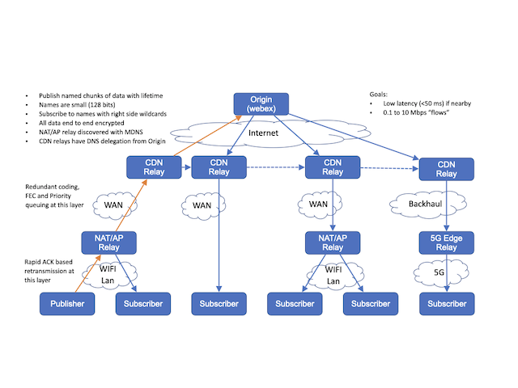
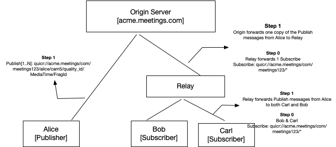

# Introduction

This outlines the design for QuicR, a media delivery protocol for applications that  needs  real time and/or near real-time data delivery experiences. It is based on a publish/subscribe metaphor where client endpoints publish and subscribe to data that is sent to, and received from, relays in the cloud. The information subscribed to is named such that this forms an overlay information centric network.

Typical usecases would be a conferencing applications (audio conferencing, webinars) that demand low latencies at larger scale (in terms of participants),  where for each endpoint to subscribe to the media/data from each of the other participants in the conference and as the same time publish
their media/data. The cloud device that receives the subscribes and distributes data is call a Relay and is similar to an SFU in the audio/video uses cases. QuicR is pronounced something close to “quicker” but with more of a pirate "arrrr" at the end.

The QuicR protocol takes care of transmitting named data from the Publisher to the Relay. It supports services (with the support of underlying transport, where necessary) to deal with detecting and limiting the bandwidth available and used, congestion control, fragmentation and reassembly, end to end encryption, and prioritization of data. The maximum lifetime of data can be controlled and important data can be marked for retransmission and so on. It is designed to be  NAT and firewall traversal friendly as well as high speed implementations in relays and use with load balancers. QuicR relay forwards data that was sent to it to all the subscribers for that data. Data is named such that it is unique for the relay and scoped to a origin. Subscriptions can include a form of wild carding to the named data.

The design is usable for sending media between a set of participants in a game or video call with under a hundred milliseconds of latency and meets needs of web conferencing systems. The design can also be used for large scale low latency streaming to millions of participants with latency under a few hundred milliseconds. It can also be used as low latency publish/subscribe system for real time in systems such as messaging and IoT.

In the simple case, an web application could have a single server implementing Relay function in the cloud that forwards packets between users in a video conference. The cloud could also have multiple relays. QuicR is designed to make it easy to implement stateless relays so that fail over could happen between relays with
minimal impact to the clients and relays can redirect a client to a different relay. It should allow for design that support high speed forwarding with ASICs, or NIC cards with on card processing, or use intel DPDK. Relay can also be chained so that a relay in a CDN network gets one copy of data from the central cloud data center and can then forward it to many clients that use that CDN. This approach can be extended to put relays very close to clients in 5G networks and put relays in home
routers or enterprise branch office that can be automatically discovered. The use of a relay between the WIFI and WAN allows for different strategies for reliability and congestion control to happen on the WAN and WIFI which can improve the overall end to end user experience.

The development of the protocol is based on optimizing the end user experience for the person using applications built with QuicR. It is not optimized to provide the highest average throughput of data.

In some settings the relay  can also be directly connected to a backend to inject published data or receive subscribes that trigger other backend logic.

# Contributing

All significant discussion of development of this protocol is in the GitHub issue tracker at TODO.

# Terminology

*   Relay Function - Functionality of the QuicR architecture, that implements store and forward behavior at the minimum. Such a function typically receives subscrptions and publishes data to the other endpoints that have subscribed to the named data.

*   Relay - a server component (physical/logical) in the cloud that implements the ```Relay Function```.

*   Publisher: An endpoint that sends data to a Relay. [ also referred to as producer of the data]

*   Subscriber: An endpoint that subscribes to data from a Relay and receives data. Relays can act as subscribers to other relays. Subscribers can also be referred to consumers of the data.

*   Client/QuicR Client: An endpoint that acts as a Publisher, Subscriber, or both. May also implement a Relay Function in certain contexts.

*   Upstream: Sending data from Publisher to Relay

*   Downstream: Sending data from Relay to a Subscriber(s)

*   Data: Application level chunk of Data that has a unique Name, a limited lifetime, priority and is transported via this protocol.


# Architecture

## Problem Space

This is design for applications such as voice and video system that are deployed in the cloud, games systems, multiuser AR/VR applications, and IoT sensor that produce real time data. It is designed for endpoints with between 0.1 and 10 mbps connection to the Internet that have a need for real time data transports. The main characteristic of real time data is that it is not useful if it is takes longer than some fixed amount of time to deliver. 

The client can be behind NATs and firewalls and will often be on a WIFI for cellular network. The Relays need to have a public IP address, or at least an IP address reachable by all the clients they serve, but can be behind firewalls and load balancers.

## Components

!---

!---

Above is one way to envision an end to end system architecture for QuicR based deploymets which is formed of following roles. These roles are logical association and same entitiy can have multiple roles in a given implementation

### NameDataIndex Server

NameDataIndex is an authorized server for a given Origin and can be a logical component of the Origin servwe. This component enables discovery and distribution of names within the QUICR architecture. Names and the associated application specific metadata are distributed via containers called Manifests. See {#Naming} for furhter detials on names and manifests.

### Publisher Function / Publuisher

[[ todo ]]

### Subscriber Function / Subscriber

[ todo]

### Relay Function / Relay

### Origin Server


# Names and Named Data

Names are basic elements with in the QuicR architecture and they uniquely identify objects. Named objects can be cached in relays in a way CDNs cache resources and thus can obtain similar benifits such caching mechanisms would offer.

Names are composed of following components:

1. Domain Component
2. Application Component

Domain component uniquely identifies a given application domain/Origin. This is like a HTTP Origin and uniquely identifies the application and a root relay. This is a DNS domain name or IP address combined with a UDP port number mapped to into the domain. Example: sfu.webex.com:5004.

Application component is scoped under a given Domain/Origin. This component is further split into 2 sub-components by the application. First component represents a static aspect of a given usage context and the final remaning bits represent dynamic aspects. Such a division would allow  efficient wildcarding rules (see Wildcarding) when supported. The length and interpretation of each application sub-component is application specific. Also to note, such a sub-division is optional and care should be taken when supporting wildcarding rules, if omitted.

Example: In this example, the domain component identifies acme.meeting.com domain, the application compoment identifies an instance of a meeting  under this domain, say "meeting123", and one of many meida streams, say camera stream, from the user "alice"
    
     ```quicr://acme.meeting.com/meeting123/alice/cam5/```
    

Names within QuicR should adhere to following constraints:

*  Names should enable compact representation for efficient transmission and storage.

*  Names should be efficiently converted to cache friendly datatypes ( like Keys in CDN caches) for storage and lookup purposes.

* Names should enable data lookup at the relays based on partial as well as whole names.

## Name Discovery

Names are discovered via manifests. The role of the manifest is to identify the names as well as aspects pertaining to the current context of the application. The content of Manifest is application defined and end to end encrypted. The manifest is owned by the application's origin server and are accessed as a protected resources by the authorized QuicR clients. The QuicR protocol treats Manifests as first level named object, thus allowing for clients to subscribe for the purposes of bootstrapping into the session as well as to follow  manifest changes during a session [ new members joining a conference for example].

To this extent, the Origin Servers MUST support following QuicR name for subscribing to the manifests.

```
quicr://domain/<application-context>/manifest
```

Also to note, a given application might provide non QuicR mechanisms to retrieve the manifest. Such mechanisms are out of scope of this document.

## Named Objects

The objects that names point to are application specific. The granularity of such data ( say media frame, fragment, datum) and its frequency are fully specifcied by a given application and they need to be opaque for relays/in-transit caches. The data objects are s end-to-end encrypted.

# QuicR Protocol

Entities within QuicR architecture communicate using publish and subscirbe protocol messages for setting up media delivery via the intermediaries such as relay and the Origin.

Entities that send data do so by sending Publish message(s) with named data and the entities that are interested in receiving data do so by sending Subscribe messages to the names of interest.

A publisher entity is responbile for producing data (aka named objects) and the subscriber entity subscribes to the data of interest with subscription(s) to the associated name. A combination of Origin and relays share the responsibility of delivering the data corresponding to the names.

[[ todo add details on authenticated messages ]]

## Publish API/Message

Entities the want to send data will use Publish API to trigger ```PUBLISH``` messages from a QuicR client to a QuicR server (Relay(s) / Origin Server). The publish message identies active flow of named data from the client to the server, such a data can be originating from a given QuicR client endpoint or a  might be relayed by other entities. In the latter case, the relaying entitiy MUST NOT change the name associated with the data being published.

[[TODO Add details end to end integrity protected and e2ee protected parts.  ]]

In general, the Publish API specifices following thing about the data being published.

```
  NAME           (String)
  RELIABLE       (Boolean)
  PRIORITY       (Enumeration)
  TTL            (Number)
  TIMESTAMP      (Number)
  DISCARDABLE    (Boolean)
  IS_SYNC_POINT  (Boolean)
  Data[...]      (Bytes)
```

__NAME__: Every ```PUBLISH``` message MUST have a name to identify the data to the QuicR components (relays/origin server/other clients). Names specified must be full names and MUST not represent partial names. 

__DATA__: The data to be published is identified by the ```Data``` field which are timestamped buffers of application data. 

__RELIABLE__: This flag indicates the data to be sent in order and reliably.

__TTL__:  Time to live defines the time after which the relays can discard the data.

__PRIORITY__: Enumeration specifies relative priority of data being published by this end-point. This can help Relay to make dropping/caching decisions

__DISCARDABLE__: Provides an hint to the relays for making drop decisions.

__IS\_SYNC\_POINT__: Synchronization point acts as reference point for the data and MUST be cached by the relays. Such data enables quck synchronizations for the subscribers.

The ```PUBLISH``` message(s) are represented as below and are embedded within a underlying transport packet.

```
PUBLISH {
  NAME           (Number64)
  FLAGS          (Byte)
  FRAGMENT       (Number16)
  TTL            (Number16)
  TIMESTAMP      (Number64)
  Data[...]      (ByteArray)
}

Flags := Reserved (3) | IsDiscardable (1) | Is_Sync_Point(1) | Priority (3)
```

## Subscribe API/Message

Entities that intend to receive data will do so via subscriptions. The Subscribe API triggers sending ```SUBSCRIBE``` messages. Subscriptions are sent from the QuicR clients to the origin server(s) (via relays, if present) and are typically processed by the relays. See {#relay_behavior} for further details. All the subsriptions MUST be authenticated and authorized. 
 
 Like ```PUBLISH```, the ```SUBSCRIBE``` message is end to end scoped. [[todo write more about this]]

[[ TODO: expand on AAA for the protocol messages]]

Subscriptions are typically long-lived transcations and they stay active until one of the following happens 
   - a client local policy dictates expiration of a subscription.
   - a server policy dicates subscription expiration.
   - the underlying transport is disconnected.

The expiry of subscription is indicated via ```SUBSCRIPTION_EXPIRY``` protocol message.

While the subscription is active for a given name, the server should be able to send data it receives for the matched name to all the subscribers. A QuicR client can renew its subscrptions at any point by sending a new ```SUBSCRIBE``` message to the origin server. Such subscriptions MUST refresh the existing subscriptions.

```
  SUBSCRIPTION_ID   (Number)  
  NAME              (String)
  TOKEN             (BYTES)
```
Note: No TTL on the ```SUBSCRIBE``` message since it doesn't go well with the aggregations when multiple clients with different TTL subscribe. It hard to pick a TTL.

### Aggregating Subscriptions

Subscriptions are aggregated at entities that perform Relay Function. Aggregating subscriptions helps reduce the number of subscriptions for a given named data in transit and also enables efficient disrtibution of published media with minimal copies between the client and the origin server , as well as reduce the latencies when there are multiple subscribers for a given named-data behind a given cloud server.

### Wildcarded Names

The name used in ```SUBSCRIBE``` can be truncated by missing the right most segments of the name that is application specific, in which case it will act as a wild card subscription to all names that match the provided part of the name. For example, in an web conferencing use case, the client may subscribe to just the origin and ResourceID to get all the media for a particular conference. Subscription message get a success or error response.

## PUBLISH_INTENT/PUBLISH_INTENT_OK Message

The PUBLISH_REQUEST message indicates the names chosen by a Publisher for transmitting data within a session. This message is sent to the Origin Server whenever a given publisher intends to publish on a new name (which can be at the beginning of the session or during mid session). This message is authorized at the Server and thus requires a mechanism to setup the initial trust (via out of band) between the publisher and the origin server before sending the  ```PUBLISH_INTENT``` message. 

 A ```PUBLISH_INTENT``` message is represented as below:
 
 ```
 PUBLISH_INTENT {
  PUBLISHER_ID   (Number64]   
  NAMES          [Number64Array]
  ORIGIN         [String]
 }
 ```

 The ```ORIGIN``` field is used by the cloud Relays to choose the Origin server to forward the ```PUBLISH_INTENT``` message.
 
 On a successful validation at the Origin server, a ```PUBLISH_INTENT_OK``` message is returned by the Origin server. 
 
 ```
 PUBLISH_INTENT_OK {
  PUBLISHER_ID   (Number64]   
  NAMES          [Number64Array]
 }
 ```

 This message enables cloud relays to know the authorized names from a given Publisher. This helps to make caching decisions, deal with collisions and so on. 
 
 `A>A cloud relay could start caching the data associated with the names that has not been validated yet by the origin server and decide to flush its cache if no PUBLISH_INTENT_OK is received within a given time. This is an optimization that would allow publishers to start transmitting the data without needing to wait a RTT.`

 [[todo add a note on allowing these messages to piggybacked with other messages to avoid RTT mid session when there is an intent to publish new names.]]

 `A> Names chosen by the publishers MUST be unique with in a given session to avoid collisions. It is upto the application define the necessary rules to ensure the uniqueness constraint. Cloud entities like Relays are agnostic to these rules and handle collisions by either overriding or dropping the  associated data.` 

## SUBSCRIBE_REPLY Message
[[todo - add ok, not-ok variants]]

## SUBSCRIBE_CANCEL Message
A ```SUBSCRIBE_CANCEL``` message indicates a given subscription is no longer valid. This message is an optional message and is sent to indicate the peer to discontinued interest in a given named data. 

```
SUBSCRIBE_CANCEL
{
    SUBSCRIPTION_ID (NUMBER)
    Reason       (String)
}
```
 
## Fragmentation and Reassembly

Application data may need to be fragmented to fit the underlyig transport packet size requirements. QuicR protocol is responsbile for performing necessary fragmentation and reassembly as driven by the underlying transport.
When fragmenting, Each fragment needs to be small enough to send in a single transport packet. The low order bit is also a Last Fragment Flag to know the number of Fragments. The upper bits are used as a fragment counter with the frist fragment starting at 1.

`A>QuicR doesn't support delivery of the partial data to the application.`


## Relay Function {#relay_behavior}

At a high level, Relay Function within QuicR architecture support store and forward behavior. Relay function can be realized in any component of the QuicR architecture depending on the application. Typical use-cases might require the intermediate servers (caches) and the origin server to implement the relay function. However the endpoint themselves can implement the Relay function in a Isomorphic deployment, if needed.

Relay function is responsible carryout the following actions to enable the QuicR protocol:

1. On reception of ``` SUBSCRIBE ``` message, forward the message to the Origin server, and on the receipt of ``` SUBSCRIBE_OK ```, store the subscriber info against the name in the ``` SUBSCRIBE ``` message. If an entry for the name exists already, add to new subscriber to the list of Subscibers. [ See Subscribe Aggregations]. 

2. If there exists a matching named data for a subscription in the cache, forward the data to the subscriber(s)

3. Optionally, On reception of ```PUBLISH_INTENT``` message, forward the message to the Origin server, and on the receipt of ``` PUBLISH_INTENT_OK ```, store the names as authorized against a given publisher.

4. If a named data arrives at the relay via ```PUBLISH``` message , cache the name and the associated data, also distribute the data to all the active subscribers, if any, matching the given name.

The data associated with a given ``` PUBLISH ``` message MUST not be cached longer than the TTL specified. Also to note, the local policies dicatated by the caching service provider can always overwrite the caching duration for the published data.

Relays MUST NOT modify the either the ```Name``` or the contents of ``` PUBLISH/SUBSCRIBE``` messags expect for performing the necessary forwarding and caching operations as described above. 

[[todo should the relay subscribe with its own ID]]

## Implications of Fragmentation and Reassembly

Relay function MUST cache full named-data objects items post  assembling the fragmented procedures. The choice of such caching is influence by attributes on the named object - discardable  or is_sync_point, for example. A given Relay implementation MAY also stored a few of the most recent full named objects regardless of the attributes to support quick sync up to the new subscribers or to support fast catchup functionalities.

When performing the relay function (forwarding), following 2 steps needs to be carried out:

1. The fragments are relayed to the subscriber as they arrive

2. The fully assembled fragments are stored based on attrbutes associated with the data and cache local policies.

It is upto the applications to define the right sized fragments as it can influence the latency of the delivery.

[[TODO add detials on the security of these messages]]

[[TODO Add info on needed handshake between relay and the origin server]] . 

## Origin Server 

The Origin server within the QuicR architecture performs the following logical roles
 
 - NamedDataIndex

 - Relay Function

 - Application specific functionality 


# QUIC Mapping

## Streams vs Datagrams

Publishers of the named-data can specify the reliability gaurantees that is expected from the QUIC transport. Setting of ```IS_RELIABLE``` flag is an indication that QuicR protocol to send the application data as Quic streams, otherwise as QUIC Datagrams.

```SUBSCRIBE```  for manifest always happens over QUIC Stream.

## Congestion Control

Based on the application profile in use, the transport needs to be able to choose the appropriate for detecting and adapting to the network congestion. A realtime application is more sensitive to congestion and the underlying mechanism needs to quickly adapt compared to, say, an application that is playing a recorded streaming media for example.

[[ todo: talk about possibility of adding RMCAT-like mechanism]]

## Recovery and Error Correction

It is important for the underlying transport to provide necessary error recovery mechanism like retransmissions and possibly a sitable forward error correction mechanism. This is especially true for packet loss sensitive applications to be resilient against these losses.


# Real-time Conferencing Application

This subsection expands on using QuicR as the media delivery protocol for a real-time multiparty A/V conferencing applications.

## Naming Considerations

Objects/Data names are formed by concatenation of the domain and application components. Below provides one possible way to subdivide the application component portion of the data names for a conferencing scenario.

* ResourceID: A identifier for the context of a single group session. Is unique withthing scope of Origin. Example: conferences number

* SenderID: Identifies a single endpoint client within that ResourceID that publishes data. Example: Unique ID for user logged into the origin application.

* SourceID: Identifies a stream of media or content from that Sender. Example: A client that was sending media from a camera, a mic, and screen share might use a different sourceID for each one. A scalable codec with multiple layers would probably use a different sourceID for each layer.

* MediaTime: Identifies an immutable chunk of media in a stream. The TAI (International Atomic Time) time in milliseconds after the unix epoch when the last sample of the chunk of media was recorded. When formatted as a string, it should be formatted as 1990-12-31T23-59.601Z with leading zeros. Example: For an audio stream, this could be the media from one frame of the codec representing 20 ms of audio.

A conforming name is formatted as URLs like:

''' quicr://domain:port/ResourceID/SenderID/SourceID/MediaTime/ '''

Below picture depicts a simplified QuicR Publish/Subscribe protocol flow where participants exchange audio in a 3-party realtime audio conference.

!---

!---


In the depicted protocol flow, Alice is the publisher while Bob and Carl are the subscribers. As part of joining into the conference, Bob and Carl subscribe to the name __qucr://acme.meetings.com/meeting123/*__  to receive all the media streams being published for the meeting instance __meeting123__. Their subscriptions are sent to Origin Server via a Relay.The Relay aggregates the subscriptions from Bob and Carl forwarding one subscribe message. On Alice publishing her media stream fragments from a camera source to the Origin server, identified via the names __quicr://acme.meetings.com/meeting123/alice/cam5/t1000/, the same is forwaded to Relay. the relay will in turn forward the same to Alice and Bob based on their subscriptions

The details of the name discovery and security/trust relationship established between the endpoints,the relay and the Origin server an d subscription expiry is ignored from the depiction for simplicity purposes.

[[todo add cases for layered codec, simulcast, idr retrieval, catchup]]


# Push To Talk Media Delivery Application

Frontline communications application like Push To Talk have close semblances with the publish/subscribe metaphor. In a typical setup, say retail stores, where there are mutiple channels (bakery, garden) and retail workers with PTT communication devices accessing the chatter over such channels. In a typical use-case, the retails workers might want to tune to their channels of interet and expect the media delivery system to deliver the media asynchornusly as talk spurts.

In general such a system needs following
* A way for the end users to tune to their channels of interest and have these interests be longlived transactions.

* A way for system to efficiently distribute the media to all the tuned end users per channel.

* A way for end user to catch up and playback when switching the channels.

Below depicts an example retail store scenario where users Alice,Bob  subscribe to the bakery channel and Carl subscribes to the gardening channel. Also an annoucement from the store manager on bakers 
gets delivered to Alice and Bob but not Carl.


 

# Streaming Media Applications

A typical media streaming application can be divided into 2 halves - media ingest and media distribution. Media ingestion is done via pushing one or more streams of different qualities to a central server. Media Distribution downstream is customized (via quality/rate adapation) per consumer by the central server.

Professional streamers interacting with a live audience on social media, often via a directly coupled chat function in the viewing app/environment. They can generate direct revenue in several ways including:

A high degree of interactivity between the performer and the audience is required to enable engagement. Lower latencies increases the engagement and consequently the incentive for the audience members to reward the performer with likes, shares, subscribes, micropayments, etc.

Typical use cases include gamers, musicians and other performers where in some part the direction of the performance can be guided by the audience response [1].

A provider wants to offer a live stream that will be used for wagering within an event. The content must be delivered with low latency and more importantly within a well-defined sync across endpoints so customers trust the game is fair. There are in some cases legal considerations, for example the content cannot be shown if it is more than X seconds behind live.

Visual and aural quality are secondary in priority in these scenarios to sync and latency. The lower the latency the more opportunities for “in play betting” within the game/event. This in turn increases revenue potential from a game/event [1].

# Virtual/Augmented Reality, Gaming Applications

Many upcoming real time applications, such as games or the ones based on virtual reality environment, have to need to share state about various objects across the network. This involves pariticipants sending small number of objects with state that need to be synchronized to the other side and it needs to be done periodically to keep the state up to date and also reach eventually consistency under losses.

Goals of such applications typically involve
- Support 2D and 3D objects
- Support delay and rollback based synchronization
- Easily extensible for applications to send theirown custom data
- Efficient distribution to multiple users

Below picture depicts QUICR architecture applied in such a setting where the participants subscribe to game state updates an

# IOT 

# Security

The key tenant of the security is that middles boxes are not trusted any more or less than the
network. They both needed to be trusted to forward packets or the packets don’t arrive but they
should not have access to data or know which human is communicating with which human. They do have a
need to understand what applications are using them.

## Reflections Attacks

QuicR needs to stop attacks where a the attacker spoofed a victims IP address and then causes
the relay to forward unwanted traffic to the victim. When a client first connects to a relay, it
goes through an authentication step to stop this. The client sends an Sync message to the relay
that contains an authorization generated from a nonce, the relay replies with a SyncOK if the
authorization is OK or a SyncNOK with a new nonce if the authorization was not OK.

The relay ignores any message received before a successful Sync.

The Sync also verifies the time on the client is approximately correct relative to the server and
provides enough information to set a time on the client if stack if needed. A Reset message can be
sent to close a connection.

## End to End Encryption

The data transmitted is encrypted and authenticated end to end with a symmetric key provided out of
band. Each publisher has their own key which is distributed to all the subscribers.

## Firewall Traversal

The header for the Sync, SyncOK, Reset message are designed such that a firewall can track them an
only allow flows if there is a successful Sync/SyncOK handshake from then inside of the firewall.
The Sync/SyncNOK/SyncOK can be rate limited.

## Fronting

A given origin relay may actually simply be fronting other relays behind it and effectively doing
a NAT style name translation of the ResourceID. This allows for TOR like onion routing systems help
preserve privacy of what participants are communicating.


# Priority

Each chunk o named data is assinged a priority by the applicaitons and packets are send in strict
prioriyt order.

TODO - work out priority levels needed. Audio layers for baseline and wideband and redundant
encodings. video need low res , high res,  I frames, other, FEC. Input, critical. low priority
background data for time warp look ahead etc.

TODO - have the priority map to DSCP and how that maps to WIFI


## Messages

The overal messages send in the UDP packets are defined by the Message
EBNF. 


## Variable Length Integer

The higher order bits indicate if the number is 1,2,4, or 8 bytes long; If the high order bit are 0,
10, 110 or 111 the integer is 7, 14, 29 or 61 bits long respectively.

A> Design choice: loosing 3 bits from 64 bit number is better than loosing 2 bits from 8 bit number.

## Short Names

Only short names are sent over wire. The Origin is not sent and MUST be same as what was sent in the
Sync. Any resource or source that match the default setup in the Sync are omitted.

## Tags

The tag values are 14 bit integers and encoded
as a variable length integer. The tag contains a flag
if it is mandatory to understand.

The tag constants are defined in
https://github.com/Quicr/quicr/blob/main/include/packetTag.hh 

## Header

First byte of packet is a magic number that has 2 bits to indicate if it is an Sync, SyncAck, Reset,
or Data so that firewalls can use that and one bit used for a spin bit.

First byte in range 80 to 87 so it can multiplex with WebRTC. See
draft-aboba-avtcore-quic-multiplexing. 

# Encryption

The data in the Pub frames ( and the data in the SubData ) is encrypted at the Frame level before it
if fragmented. Thus all the fragments need to be received for it to be decoded.

Data + origin + short Name is authenticated. Short name expanded to 64 bit integer version of all
IDs before authentication.

The key could be generated from a TLS handshake, a MLS session, or just provided by a cloud oracle.

TODO key selection

The short name is unique for this data so can be used as the IV.

Fragments are not encyrpted, only the full defragemnted data so ShortName allways has a FragmentID
of 3;

Data is encrypted with AES-CM-128-HMAC-SHA256-X where X is 0, 1,4,8, or 16 bytes.

Inputs: plainText, origin, shortName, tagLen, senderKey

prk = HKDF-SHA256-Setup( origin | senderKey, "QuicR 1" ) encKey = HKDF-SHA256-Extract( prk, "enc1" ,
128/8 ) authKey = HKDF-SHA256-Extract( prk, "auth1" , 256/8 )

nonce = HKDF-SHA256-Extract( prk, "salt1" | shortname , (128-16)/8 )

iv = nonce | one16bit cipherText = AES128-CTR( encKey, iv, plainText )

textLen = len( plainText ) authData = tagLen | origin | shortName fullTag = HMAC_SHA256( authKey,
cipherText | textLen | authData ) tag = truncate( fullTag, tagLen )

Output: cipherText, authTag

Note: one16bit is a 16 bit integer of value 1. This allows for 2^16 uses of AES128 with that IV
which gives 1 MB of data for the chunk.

Note: HKDR basicly turns in into HMAC. HMAC turns into two SHA.

Keys should not be used for more than 12 hours and must not be used for encryption more than TODO
times.

The time that a MediaTime that a key becomes valid is kept for each SenderID and used to lookup the
correct key.

# NATs, Firewalls, Load balancers

NAT traversal works by having the Relay always reply to whatever source IP/port a packet was
received from, and the Relays are on an IP address reachable by all client.

Firewalls can rate limit the flow over the UDP 5-tuple to 1kbps until either a Sync or SyncOK is
seen from the inside of the firewall. The 5-tuple can be put back in the rate limited stat if either
no data is seem from inside the firewall for 30 seconds or a Reset is seen from inside the firewall.

Simple load balancers can forward the Sync packets based on load of relays in a pool then keep
future packets in that same UDP 5 tuple sticky to the relay the Sync was sent to.

# Zero RTT

The Syn, Pub, and Sub can call be sent overlapped at the same time to get a zero round trip time
startup.

# Relays

## Relay Chaining

TODO - add concept root relay

Clients may be configured to connect to a local relay which then does a Pub/Sub for the appropriate
data towards the origin in the named of data or towards another Relay. These relay can aggregate the
subscriptions of multiple clients.

This allows a relay in the LAN to aggregate request from multiple clients in subscription to the
same data such that only one copy of the data flows across the WAN. In the case where there is only
one client, this may still provides benefit in that a client that is experiencing loss on WIFI WAN
has a very short RTT to the local relay so can recover the lost data much faster, and with less
impact on end user QoE, than having to go across the LAN to recover the data.

Relays can also be deployed in classic CDN cache style for large scale streaming applications yet
still provide much lower latency than traditional CDNs using Dash or HLS. Moving these relays into
the 5G network close to clients may provide additional increase in QoE.

## Relay fail over

A relay that wants to shutdown and use the redirect message to move traffic to a new relay

If a relay has failed and restarted or been load balanced to a different relay, the client will
send a Sync within 1 second and the relay will send a SyncAck with a new relay sequence number. The
client needs to detect this is a new relay and resend any subscribes. The client should assume that
bandwidth and RTT has not changed.

Cluster so high reliable relays should share subscription info and publication to minimize of loss
of data during a full over.

## Relay Discovery

Local relays can be discover via MDNS query to TODO.

# Acknowledgements


Thanks to TODO for review and contributions.

# TODO move - Real Time Applications

A key characteristics of real time internet applications is they:

1.  have a strict time budget after which the information is no longer useful,
2.  run in network conditions where at some points in time there is not enough bandwidth to send
    everything they wish.

To achieve this, the transport need to make a tradeoff between throughput, delay, and loss. The
transports trade off theses three aspects to maximize some users experience such as a video call or
game play. This is a very different problem than a traditional transport like TCP trying to maximize
average throughput.

Figure triangle , Throughput, delay, loss

# Appendix Extension: Consolidation

Allow merge of packets, prefer constant packet rate in defined packet transmission internal.

TODO - move to be in the priority Q

# Appendix Extension:  Version Negotiation and Extensibility

The two main concepts for extensibility is a negotiate feature vector and tags. Each new feature,
including non backwards compatible version of the protocol are given a features number. The client
and relay use a bit vector with bits sets for support or used features to negotiation which features
to use. The other concepts is that information is encoded in Tag, Length, value tuples so that an
implementation that does not support a given tag, knows if the tag is mandatory to understand and
the length of it so that the parse can skip over tag, length, value tuples (often call just tags)
that it does not understand.

Tags that have a fixed length, do not encode the tag on the wire. All tags are published in machine
readable form on GitHub and the assumption is that implementations that need interoperability will
be able to parse all tags in the table within 18 weeks of the tag being added to the table. This
does not mean the implementations have implemented the tag, but just that the parser is updated to
recognizes the tag and be able to skip over the tag. Short tags are tags that are a 7 bit number and
are reserved for allocation to tags that are both frequently and widely used that need the reduced
bandwidth. Normal tags are out of a 14 bit space and are allocated on first come first serve basis.

Extension can be allocated a extension number. The Sync packet has an supported extension bit vector
where the n'th bit it set if the client supports extension number n. The SyncAck contains an use
extension bit vector where the n'th bit indicates that the client should use that extension.

# Appendix Extension:  Stats

Client should periodically (perhaps every 10 seconds) send stats to the Relay.

# Appendix Extension:  Redirect

Relay can send a message to client with address of new relay. Client send a Sync to new relay
along with all Subscriptions. After that is done the Client unsubscribes from old relay and closes
connection to it.

This allows for make before break transfer from one relay to another so that no media is lost during
transition. One of the uses of this is upgrade of the Relay software during operation.

# TODO

Assume codecs are safe. Send auth tag 1 per second and rest of media no auth

~~~
Packet rates
     ppp   delay  maxRate    minRate
 960 pps =  1ms = 9.2 mbps  = 384 kbps
 240 pps =  4ms = 2.3 mbps  =  96 kbps
  60 pps = 17ms = 0.6 mbps  =  24 kbps
  15 pps = 67ms = 144 kbps  =   6 kbps
~~~

~~~
Constant packet rate helps deal with burst loss
1000 pps =   1 ms = 9.6 mbps  = 400 kbps
 500 pps =   2 ms = 4.8 mbps  = 200 kbps
 300 pps =   3 ms = 2.9 mbps  = 120 kbps
 100 pps =  10 ms = 960 kbps  =  40 kbps
  50 pps =  20 ms = 480 kbps  =  20 kbps
  30 pps =  33 ms = 288 kbps  =  12 kbps
  10 pps = 100 ms =  96 kbps  =   4 kbps
~~~

TODO - congestion control

UWW - Use what works

vary bandwidth, packet rate, and DSCP

TODO - so because all seq num not authed, attacker can fuck with timing of things and DDoS flow
