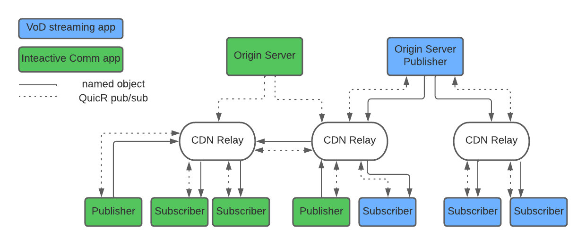

# Introduction

Interactive realtime applications ,such as interactive communication systems, have very strict requirements around ultra low latency. Such applications create their own application-specific delivery network over which such ultra low latency requirements can be met. Realtime transport protocols such as RTP provide the basic elements needed for realtime communication, both contribution and distribution, while leaving aspects such as resiliency and congestion control to be provided by each application.

On the other hand, media streaming applications are much more tolerant to latency and require highly scalable media distribution. Such applications leverage existing CDN networks ,used for optimizing web delivery, to distribute media using standards such as HLS and MPEG-DASH.

Recently new use cases have emerged requiring higher scalability of delivery for interactive realtime applications and much lower latency for streaming applications and a combination thereoff.

This document outlines a unified architetcure for data delivery that enables a wide range of realtime applications with different resiliency and latency needs. The architecture defines and uses QuicR, a delivery protocol that  is based on a publish/subscribe metaphor where client endpoints publish and subscribe to named objects that is sent to, and received from, relays that forms an overlay delivery network similar to what CDN provides today. QuicR is pronounced something close to “quicker” but with more of a pirate "arrrr" at the end.

A typical usecase is an interactive communication application, e.g. video conferencing, where each endpoint in the conference subscribes to the media from the participants in the conference and at the same time publishes its own media. The cloud device that receives the subscriptions and distributes media is called a Relay and is similar to an application-independent SFU in the audio/video conferncing uses cases. 

The QuicR protocol takes care of transmitting named objects from the Publisher to the Relay and from the Relay to all the subscribers of the named dobject. It provides transport services selected and tuned based on application requirements (with the support of underlying transport, where necessary) such as detecting available bandwidth, fragmentation and reassembly, resiliency, congestion control and prioritization of data delivery based on data lifetime and importance of data. It is designed to be NAT and firewall traversal friendly and can be upfronted  with load balancers. Objects are named such that it is unique for the relay/delivery network and scoped to an application. Subscriptions can include a form of wildcarding to the named object.

The design supports sending media and other named objects between a set of participants in a game or video call with under a hundred milliseconds of latency and meets the needs of web conferencing systems. The design can also be used for large scale streaming to millions of participants with latency ranging from a few seconds to under a few hundred milliseconds based on applications needs. It can also be used as low latency publish/subscribe system for real time systems such as messaging and IoT.

In the simplest case, a web conferencing application could use a single relay to forward packets between users in a video conference. However a more typical scenario would have a delivery network made of multiple relays spread across several points of presence. QuicR is designed to make it easy to implement stateless relays so that fail over could happen between relays with
minimal impact to the clients and relays can redirect a client to a different relay. 

# Contributing

All significant discussion of development of this protocol is in the GitHub issue tracker at TODO.

# Terminology

* Relay Function: Functionality of the QuicR architecture, that implements store and forward behavior at the minimum. Such a function typically receives subscrptions and publishes data to the other endpoints that have subscribed to the named data. Such functions may cache the data as well for optimizing the delivery experience.

* Relay:  Server component (physical/logical) in the cloud that implements the Relay Function.

* Publisher: An endpoint that sends named obejcts to a Relay. [ also referred to as producer of the named object]

* Subscriber: An endpoint that subscribes and receives the named objects. Relays can act as subscribers to other relays. Subscribers can also be referred to as consumers.

* Client/QuicR Client: An endpoint that acts as a Publisher, Subscriber, or both. May also implement a Relay Function in certain contexts.

* Named Object: Application level chunk of Data that has a unique Name, a limited lifetime, priority and is transported via this protocol.

* Origin server: Component managing the QuicR namespace for a specific application and is responsible for establishing trust between clients and relays. Origin servers can implement other QuicR functions.

# QuicR characteristics and its Relationship to existing streaming standards

[To DO] Shold we say something about RTP!

As its evident, QuicR and its architetcure uses similar concepts and delivery mechanisms to those used by streaming standards such as HLS and MPEG-DASH. Specifically the use of a CDN-like delivery network, the use of named objects and the receiver-triggered media/data delivery. However there are fundamental characteristics that QuicR provides to enable ultra low latency delivery for interactive applications such as conferncing and gaming. 

* To support low latency the granularity of the delivered objects ,in terms of time duration, need to be quite small making it complicated for clients to request each object individually. QuicR uses a publish and subcription semantic along with a wildcarded naming to simplify and speed object delivery. 

* Certain realtime applications operating in ultra low latency mode require objects delivered as and when they are avaiable without having to wait for previous objects that have not yet been delivered due to network loss or out of order network delivery. QuicR supports Quic datagrams based object delivery for this purposes. Note that QuicR also allows for both Quic datagram and stream usages based on the application's latency/quality requirements.

* QuicR supports resiliency mechanisms that are more suitable for realtime delivery such as FEC and selective retransmission. 

* Quic's current congestion control algorithms need to be evaluated for efficacy in low latency interactive real-time contexts specially when it comes to mechanisms such as slow start and multiplicative decrease. Based on the results of the evaluation work, QuicR can select the congestion control algorithm suitable for the application's class.

* Published objects in QuicR have associated max-age that specifies the validity of such obejcts. max-age influences relay's drop decisions and the used by the underlying Quic transport to cease retransmissions associated with the named object.

* Unlike streaming architectures where media contribution and media distribution are treated differently, QuicR can be used for both object contribution/publishing and distribution/subscribing as the split does not exist for interactive communications.  

* QuicR supports "aggregation of subscriptions" to the named objects where the subscriptions are aggregated at the relay functions and allows "short-circuited" delivery of published objects when there is a match at a given relay function.

* QuicR allows publishers to associate a priority with objects. Priorities can help the delivery network and the subscribers to make decisions about resiliency, latency,drops etc. Priorities can used to set relative importance between different qualities for layered video encoding, for example.

* QuicR is designed so that objects are encrypted end-to-end and will pass transparently through the delivery network. Any information required by the delivery network, e.g priorities, will be included as part of the metadata that is accessible to the delivery network for further processing as appropriate.

# Architecture

## Problem Space

[To Do] Need work

This architetcure is designed for applications such as video communication systems, video streaming systems, games systems, multiuser AR/VR applications, and IoT sensor that produce real time data. It is designed for endpoints with between 0.1 and 10 mbps connection to the Internet that have a need for real time data transports. The main characteristic of real time data is that it is not useful if it is takes longer than some fixed amount of time to deliver. 

The client can be behind NATs and firewalls and will often be on a WIFI for cellular network. The Relays need to have a public IP address, or at least an IP address reachable by all the clients they serve, but can be behind firewalls and load balancers.

## Components

!---

!---

Above diagram shows the various components/roles making the QuicR architecture and how it can be leveraged by two different classes of applications; a streaming app and a communication app.

[[todo explain the picture including the various components of publcishers, subscribers, origin server]]

# Names and Named Objects

[Q: Is this the right level of derails for this draft?]

Names are basic elements with in the QuicR architecture and they uniquely identify objects. Named objects can be cached in relays in a way CDNs cache resources and thus can obtain similar benifits such caching mechanisms would offer.

Names are composed of following components:

1. Domain Component
2. Application Component

Domain component uniquely identifies a given application domain. This is like a HTTP Origin and uniquely identifies the application and a root relay. This is a DNS domain name or IP address combined with a UDP port number mapped to into the domain. Example: sfu.webex.com:5004.

Application component is scoped under a given Domain/Origin. This component is further split into 2 sub-components by a given application. First component represents a static aspect of the application's usage context (meetingId in a conferencing applications) and the final sub-component represent dynamic aspects (stream/encoding time). Such a division would allow for efficient wildcarding rules (see Wildcarding) when supported. The length and interpretation of each application sub-component is application specific. Also to note, such a sub-division is optional and care should be taken when supporting wildcarding rules, if omitted.

Example: In this example, the domain component identifies acme.meeting.com domain, the application compoment identifies an instance of a meeting  under this domain, say "meeting123", and one of many meida streams, say camera stream, from the user "alice"
    
     ```quicr://acme.meeting.com/meeting123/alice/cam5/```

`A> Above representation of the name to be considered as application input and not
the form that gets encodeded. A given application MAY choose a different way to 
represent the name at the application layer. For QuicR messages names are represented
as integers`.    

Names within QuicR should adhere to following constraints:

* Names should enable compact representation for efficient transmission and storage.
* Names should be efficiently converted to cache friendly datatypes ( like Keys in CDN caches) for storage and lookup purposes.
* Names should enable data lookup at the relays based on partial as well as whole names.

## Name Discovery

Names are discovered via manifests. The role of the manifest is to identify the names as well as aspects pertaining to the associated data in a given usage context of the application. The content of Manifest is application defined and end to end encrypted. The manifest is owned by the application's origin server and are accessed as a protected resources by the authorized QuicR clients. The QuicR protocol treats Manifests as first level named object, thus allowing for clients to subscribe for the purposes of bootstrapping into the session as well as to follow  manifest changes during a session [ new members joining a conference for example].

[todo should the maifest be end to end encrypted ?]

To this extent, the origin Servers MUST support following QuicR name for subscribing to the manifests.

```
quicr://domain/<application-static-component>/manifest
```

Also to note, a given application might provide non QuicR mechanisms to retrieve the manifest. Such mechanisms are out of scop and can be used complementary to the approaches defined in this specification.

## QuicR media objects

The objects that names point to are application specific. The granularity of such data ( say media frame, fragment, datum) and its frequency are fully specified by a given application and they need to be opaque for relays/in-transit caches. The data objects are end-to-end encrypted.

[To Do] Should we do some hand waving here about mapping media into objects and talk about synchronization point trade-offs etc.?


